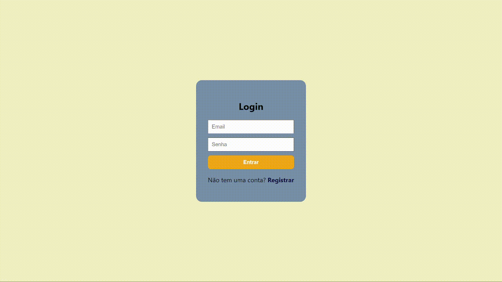
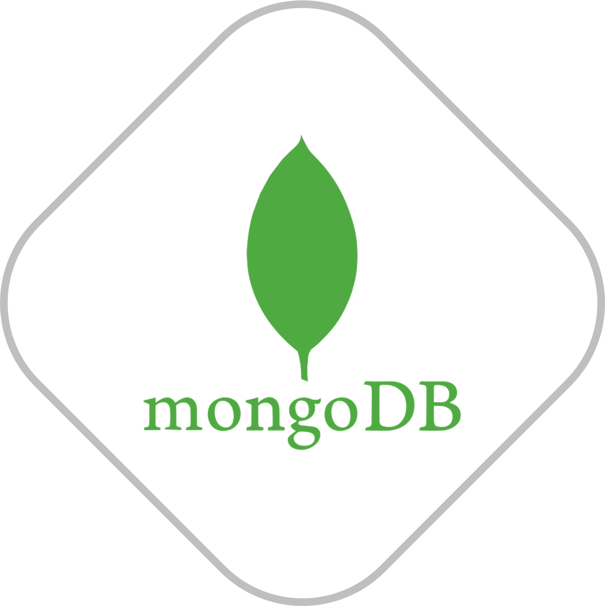
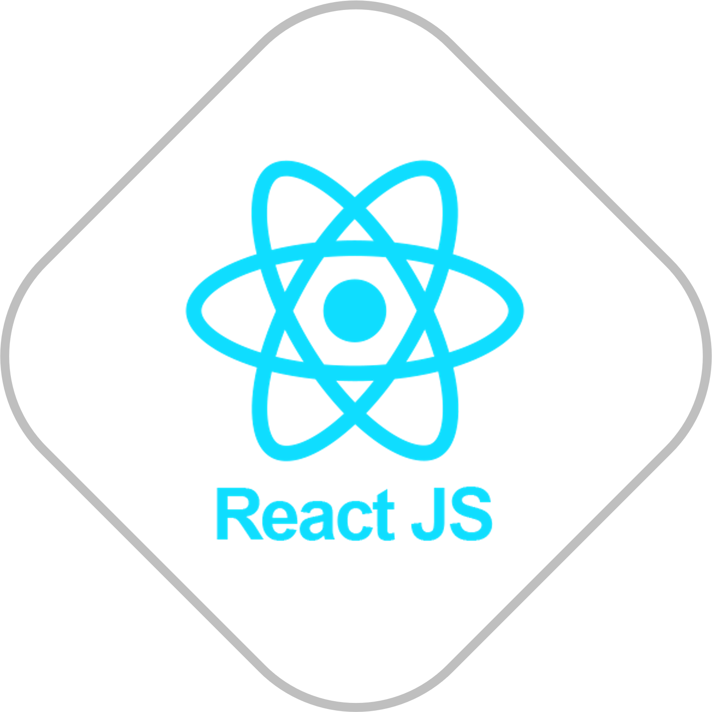
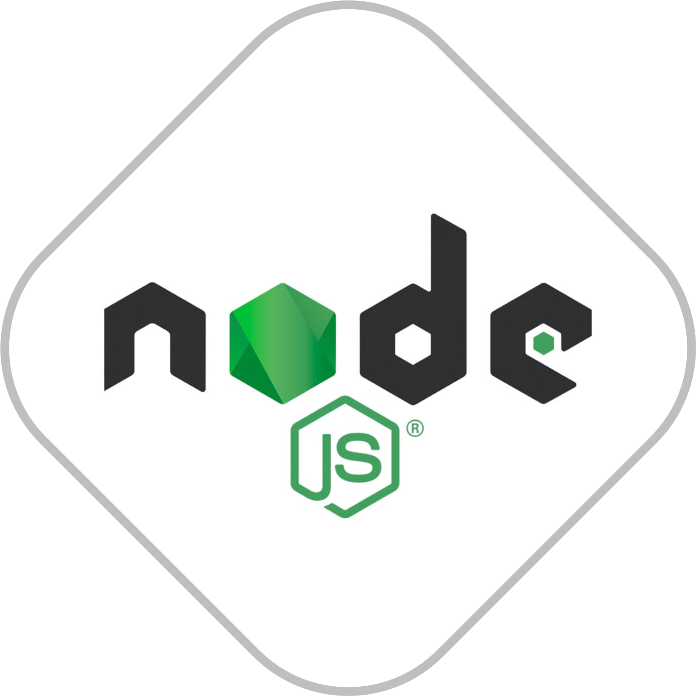

<h1 align="center">MERN-SignUp</h1>

## 💬 Sobre

Este é um site de login e cadastro de usuários, criado como parte de um projeto do segundo semestre da faculdade na disciplina de Desenvolvimento Web Avançado (DWA) do IFSP Cubatão.
   

## 🌟 Integrantes

Integrantes do grupo responsáveis por cada tarefa:

- **Banco de dados:** Miguel Luizatto e Beatriz Bastos
- **Backend:** Lucas Lopes e Laysa Bernardes
- **Frontend:** Edu Fodor
 

## 🚀 Tecnologias

 

 Utilizamos Node.js, React e MongoDB para criar uma plataforma de registro simples e eficaz. Explorando o código você poderá ver melhor o trabalho realizado com essas tecnologias avançadas que foram incorporadas neste projeto! 

 
 

## 📌 Nota

Para que o Frontend e o Backend funcione, siga os passos abaixo:

- **Config Frontend:**
  - Abra o terminal integrado do Frontend e escreva *"npm install"*
  - Após isso, com o terminal do Frontend aberto, digite *"npm start"*
 

- **Config Backend:**
  - Abra o terminal integrado do Backend e escreva *"npm install"*
  - Após isso, com o terminal do Frontend aberto, digite *"npm start"*
 

## ✏️ Documentação

PDF: [<a href="previre">](https://github.com/LucasLoopsT/MERN-SignUp/blob/main/preview/MERN-SignUp.pdf)https://github.com/LucasLoopsT/MERN-SignUp/blob/main/preview/MERN-SignUp.pdf

